📘 Guia de Criação do Ambiente no Azure AI Foundry

Este passo a passo demonstra como criar o ambiente necessário para desenvolver o agente MIZA – FinOps Cloud Copilot dentro do Azure AI Foundry, atendendo aos requisitos do desafio.

---

🧭 1. Acessando o Portal Azure

Acesse:

🔗 https://portal.azure.com/

No menu inicial, selecione Recursos.

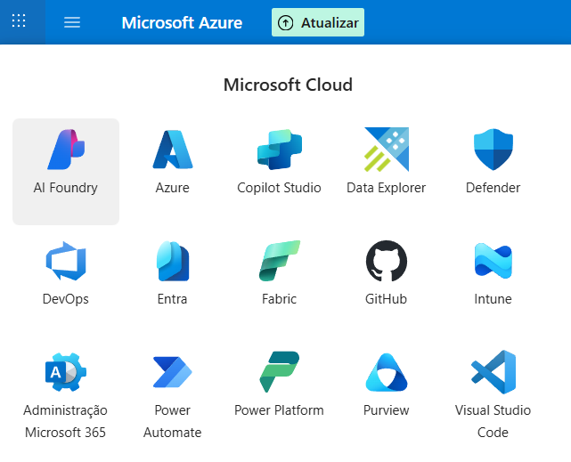

📌 Região recomendada: Canadá Oeste (melhor latência para o Brasil nas assinaturas AFG).

---

🗂 2. Criando o Grupo de Recursos

Abra o menu sanduíche (≡) e procure Resource Groups.

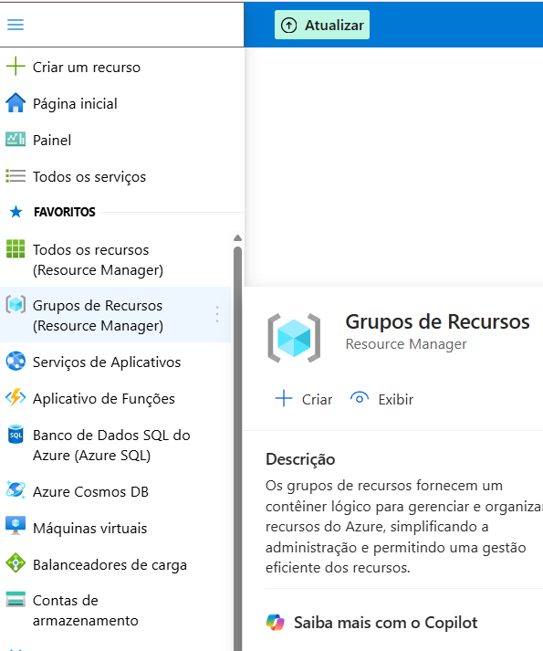

Clique em Create para criar um novo grupo.

➕ Criar Grupo de Recursos

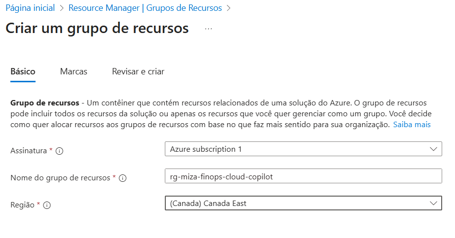

🏷 Criar Tags (boa prática)

Adicione tags para organização e governança.

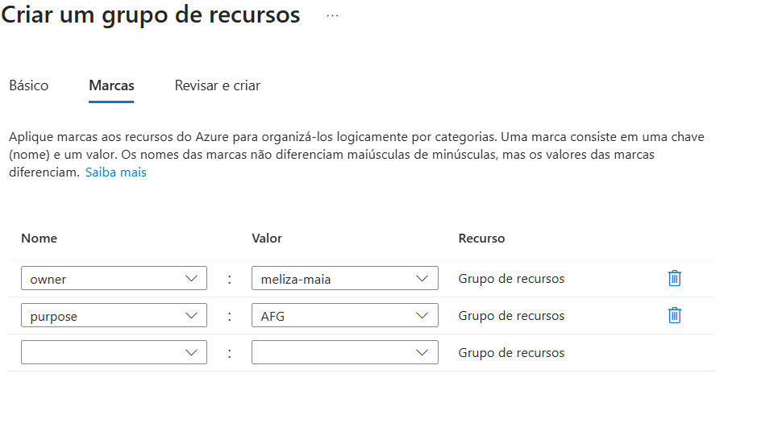

✔ Revisar e Criar

---

📦 3. Conferindo o Grupo de Recursos

Entre no grupo criado:

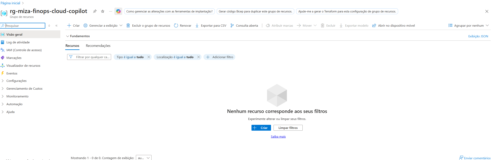

Verifique se tudo foi criado corretamente:

---

🛒 4. Criando o Serviço do Azure AI Foundry

No grupo de recursos, clique em Create e depois em Marketplace.

No campo de busca, digite:

➡ "AI Foundry"

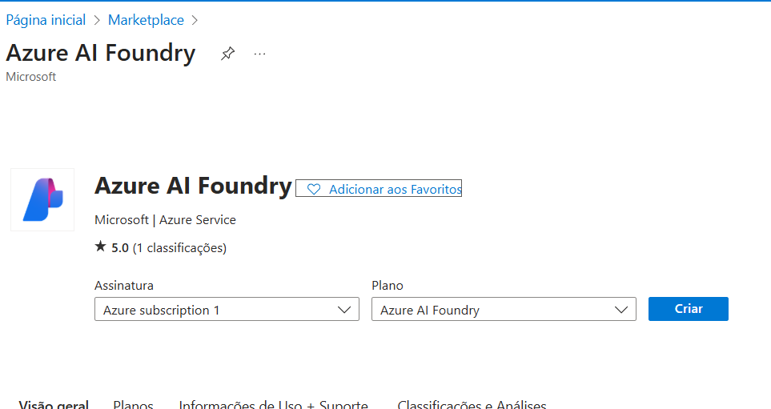

---

🔍 5. Conferindo Providers

No Marketplace, verifique se todos os providers são Microsoft.

Se aparecer “Partner” → não está incluso no plano AFG.

Use a tabela da documentação oficial para checar os acrônimos.

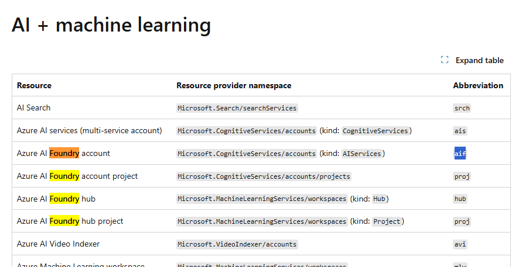

🟣 AFG = Azure Frontier Girls
Seu crédito da trilha é aplicado nesse provedor.

---

⚙ 6. Configuração da Criação

Tipo de Plano: Criar um recurso da Fábrica de IA no Azure

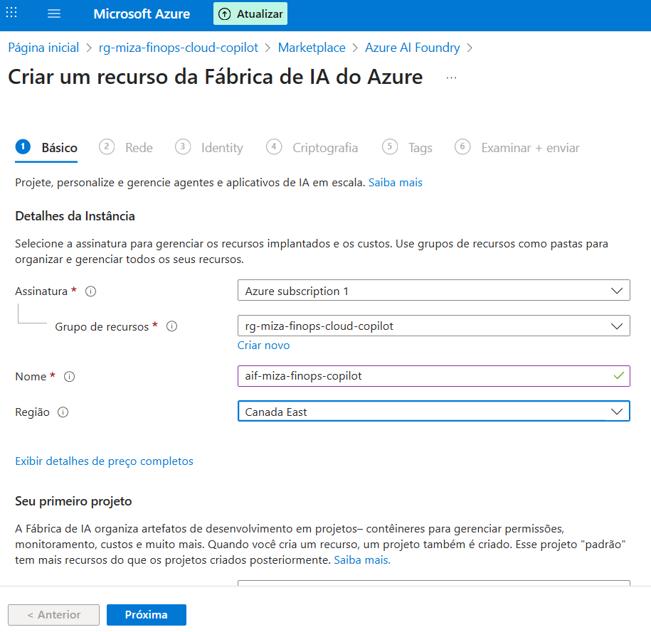

Disponibilidade: marque All (os demais exigem configurações adicionais).

Identidade atribuída automaticamente

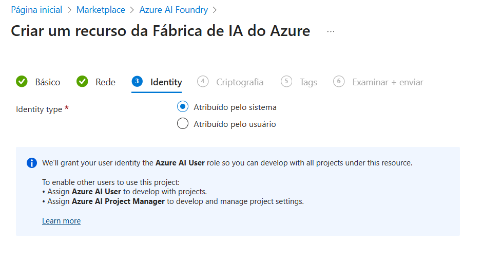

🔐 Encriptação

Mantenha Padrão.

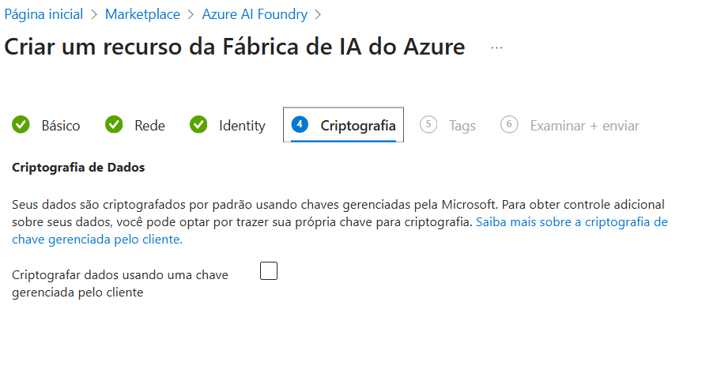

🏷 Adicione a Tag AFG

Importante para controle e governança da assinatura.

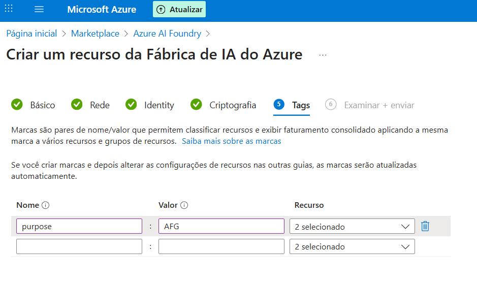

✔ Validar e Criar

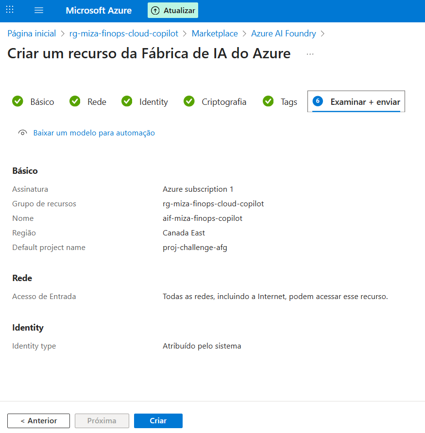

---

🚀 7. Deployment

Após alguns segundos/minutos, o recurso será implantado.

Clique em Ir para o recurso.

---

📡 8. Acessar o Azure AI Foundry Portal

No recurso criado, abra a aba Overview (Visão Geral).

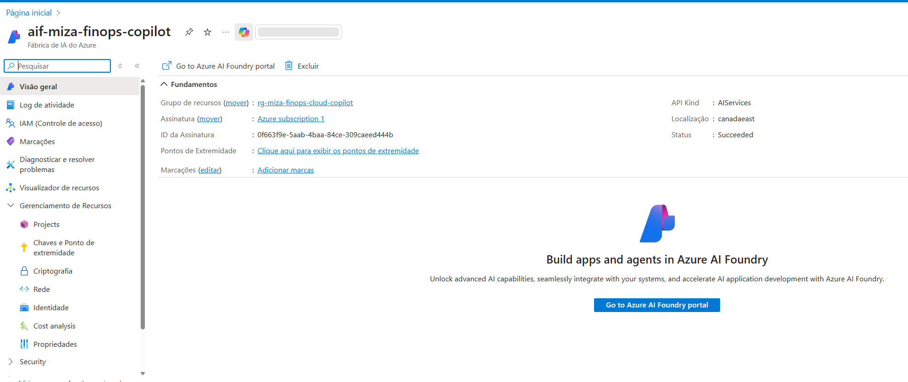

Clique em:

➡ Go to Azure AI Foundry Portal

O portal abrirá em nova janela:

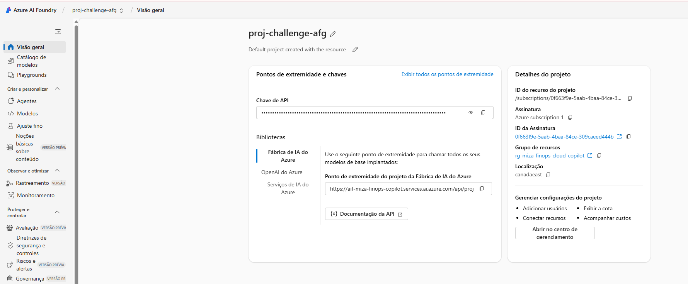

---

🧱 9. Entendendo o Azure AI Foundry

O portal funciona como um frontend administrativo:
cada item da barra lateral chama um endpoint do back-end (API).

---

🤖 10. Acessando Modelos (Models)

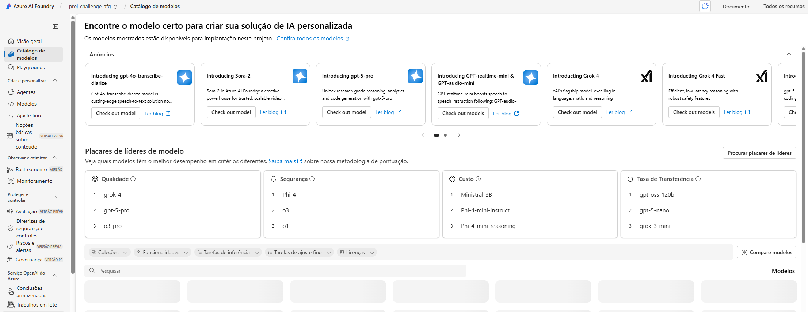

Aqui você encontra:

Modelos de linguagem (GPT, Phi, Mistral)

Modelos de visão

Modelos de fala

Modelos especializados

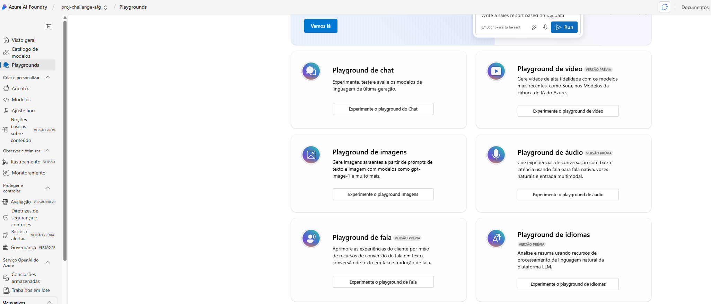

---

🧩 11. Gerenciamento de Projetos

Você pode criar múltiplos projetos dentro do mesmo workspace.

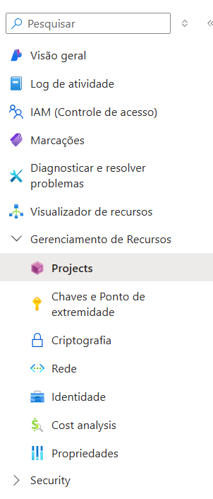

---

📁 12. Acessando Seu Projeto

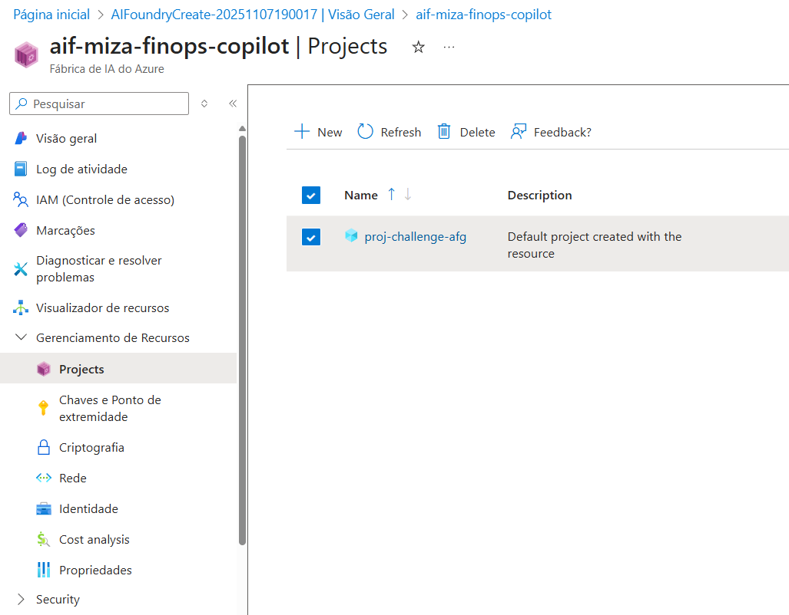

Entre no projeto ou clique novamente em:

➡ Go to Azure AI Foundry Portal

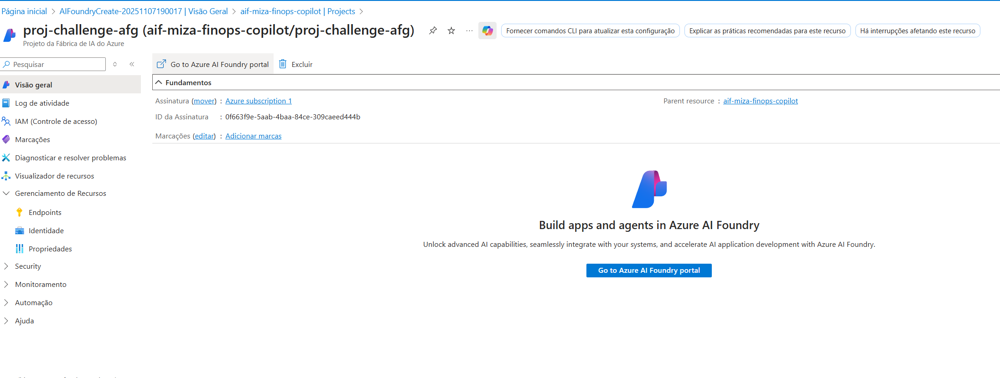

---

📚 13. Portal já inicializado com bibliotecas

Lembrando que o ambiente já vem com bibliotecas pré-configuradas:

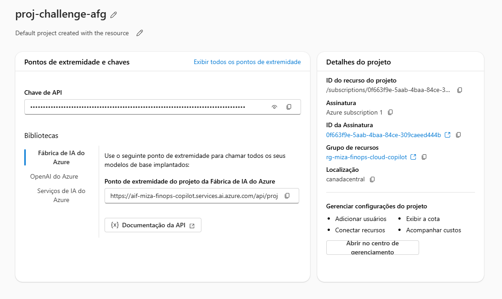

🎉 Conclusão

Você configurou com sucesso:

✔ Grupo de Recursos
✔ Serviço Azure AI Foundry
✔ Tags de governança
✔ Ambiente operacional
✔ Acesso ao workspace e modelos